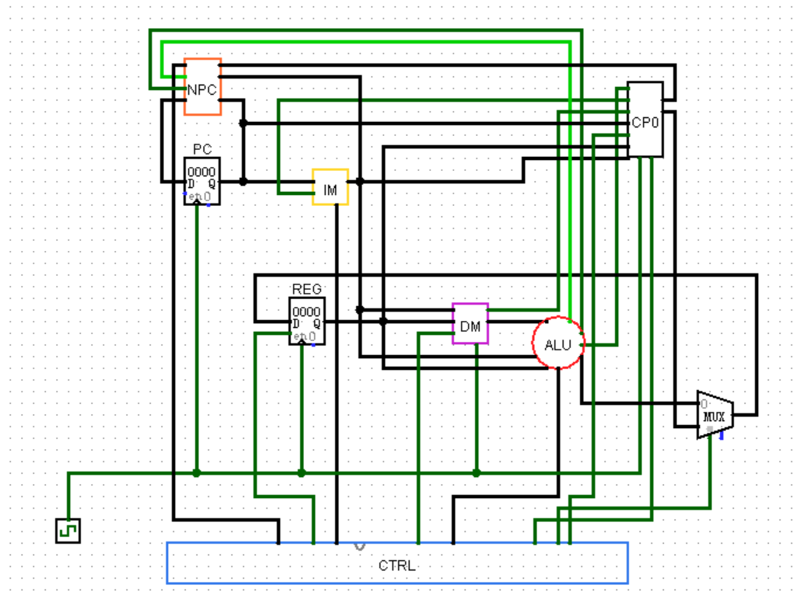
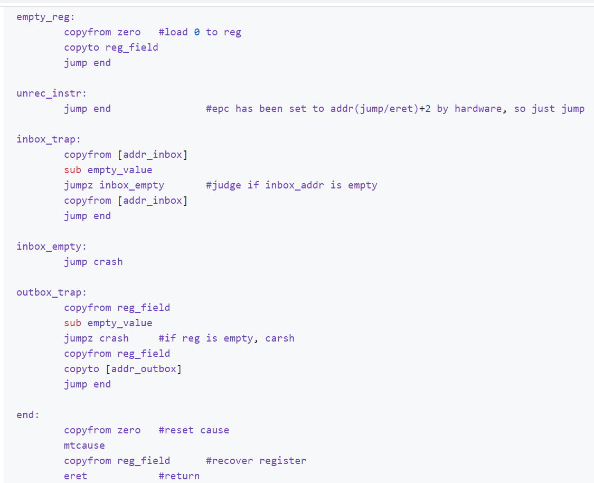

# Human Resource Machine架构CPU设计

## 简介

人力资源机器（Human Resource Machine）是一款手机编程游戏，玩家可通过指令操作主角员工从传送带取、放箱子（数字）进行运算，完成指定任务。游戏截图如上图所示。

 该款游戏实质像极了汇编语言。在学完计组后，我们出于兴趣进行了基于该游戏的CPU架构的设计。

我们的设计包括以下内容：

— HRM架构指令集

— 基于HRM架构的CPU，支持异常处理

— HRM指令汇编器

 

## 指令集

指令集架构包括：

— 2条IO指令 (INBOX, OUTBOX)

— 6条顺序运算指令 (COPYFROM, COPYTO, ADD, SUB, BUMPUP, BUMPDN)

— 3条跳转指令 (JUMP, JUMPZ, JUMPN)

— 若干内核态指令 (ERET, MFCAUSE, MTCAUSE, etc.).

所有指令被分为N指令、J指令和S指令三类。

指令集基本复现了游戏所有原有指令，并增加了异常处理及内核区内存访问的内核态指令。

指令集完整设计参见：https://github.com/wzk1015/HRM-Architecture/blob/master/Documentation/instruction-set.md

 

## CPU

出于更多功能而非性能的考虑，处理器设定为16位RISC单周期CPU，并带有CP0协处理器，支持同步异常的处理。

下图为一个早期版本的电路设计（可在https://github.com/wzk1015/HRM-Architecture/tree/master/Circuit中查看）

 

 

CPU中仅有一个寄存器，以模拟游戏中的主角员工。内存用以模拟游戏中地面上的box存放位置。

CPU设计参见：https://github.com/wzk1015/HRM-Architecture/blob/master/Documentation/cpu%20modules%20design.md

 

## 汇编器

此链接包括python实现的汇编器及介绍文档：https://github.com/wzk1015/HRM-Architecture/tree/master/Assembler

汇编器支持由汇编码向机器码的转换，并支持定义宏、设定跳转标签、分配数据空间、内存空间设定。

为了使得汇编程序可以在现有汇编器的模拟环境（例如MARS）上运行，该汇编器同样支持HRM汇编向MIPS的指令转换。

 

## 物理内存映射

内存没有经过虚存映射进行管理，程序可以直接对物理内存进行访问，通过硬件设定权限异常来防止对越界范围内存的读写操作。

由于指令集的架构局限，内存空间为16位编址，其中低2^12字节区域属于用户区域，其余部分为内核区域。

用户区和内核区均包含数据段和代码段，其中内核代码段包括异常处理程序exception handler。

此外内核区包括IO设备可读写的内存区域，用于inbox、outbox指令的数据传输。

受限于指令集无法支持立即数的限制，内存中设定了静态地址区域存放常用的常数，以方便用户和内核进行运算操作。

内存映射参见：https://github.com/wzk1015/HRM-Architecture/blob/master/readme.md

 

## 异常处理

HRM架构CPU支持算术溢出、内存为空（模拟游戏设定）、权限异常、IOtrap等异常，通过协处理器CP0进行捕获和状态保存。

参考了MIPS架构的异常分派机制，在异常处理程序中根据异常类型进行分派并单独处理。

异常处理参见：https://github.com/wzk1015/HRM-Architecture/blob/master/Documentation/exceptions%20and%20cp0.md

该文档也包括一个示例的异常处理程序，可以对HRM的异常机制以及汇编指令有初步的了解。

 

 

