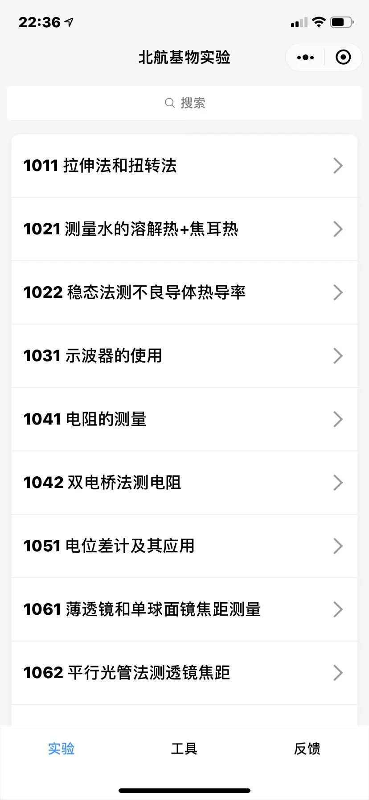
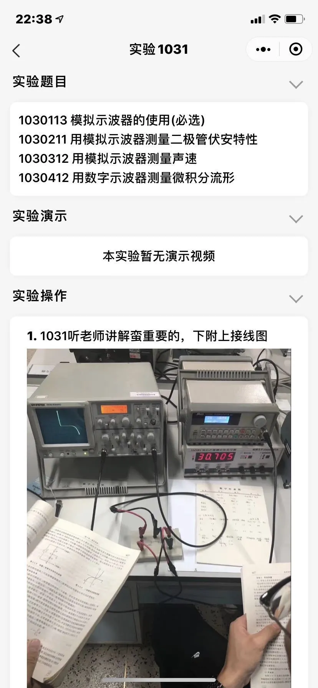
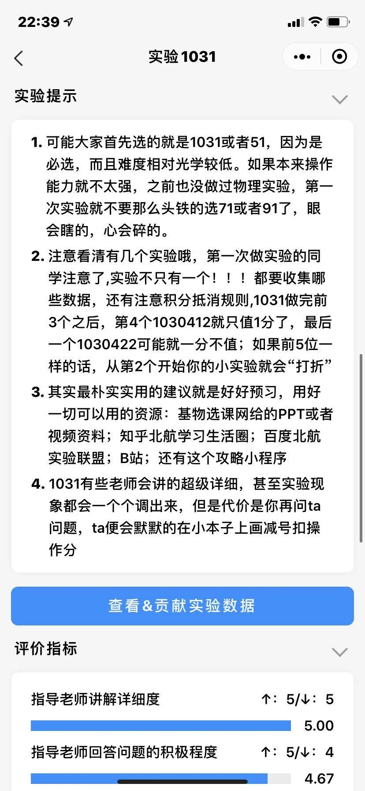
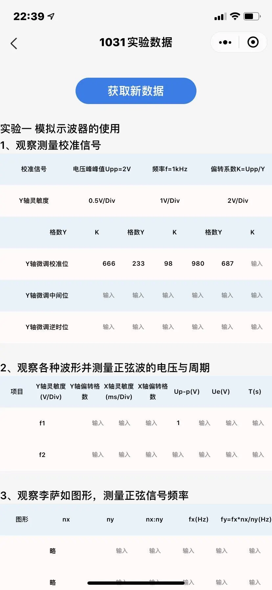
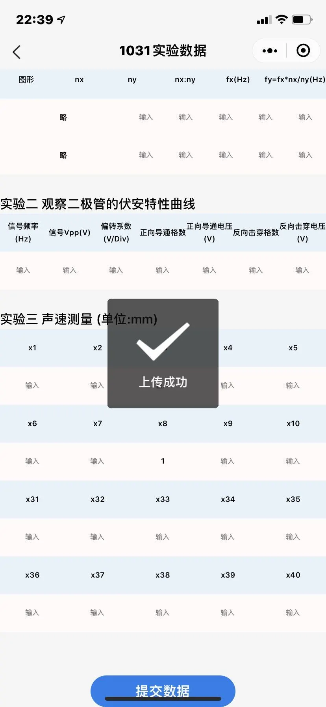
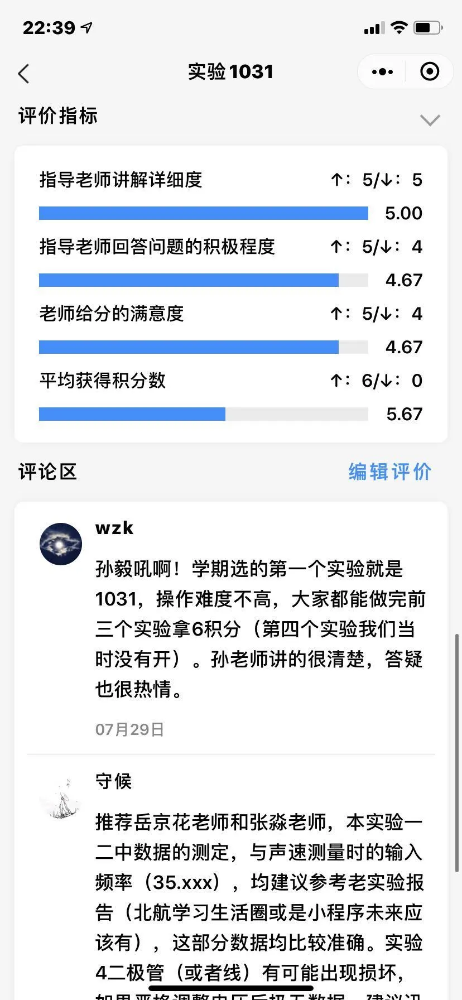
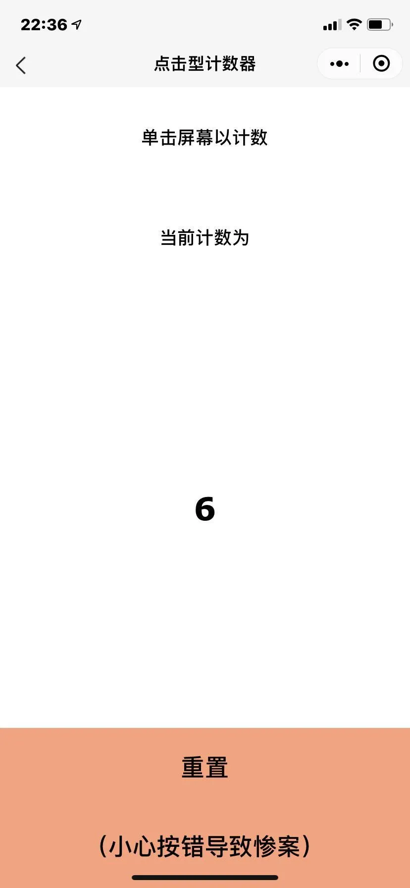
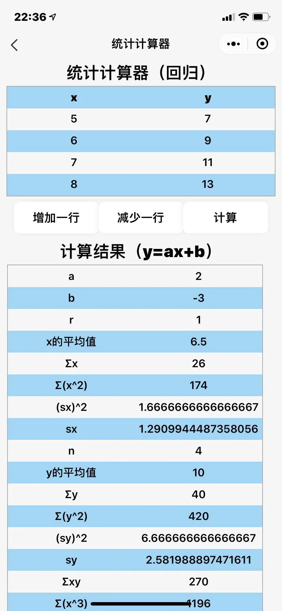
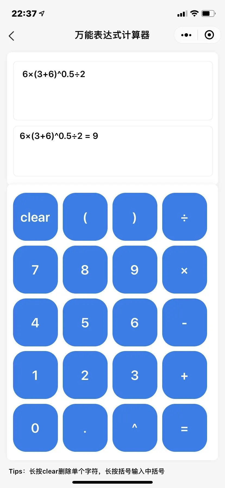

# 北航基物实验小程序

一个自发的学习项目，团队开发，帮助学弟学妹攻克基物实验

扫码即可使用~

## 功能

### 查看实验注意事项

图文并茂讲述实验细节&小技巧

### 获取和上传实验数据

### 发表评价

评价指导老师、获得的积分数，查看评分统计，向大家分享你的实验经验

### 使用实用工具

做实验时手机打开计数器、计算器，再也不会手算到抽筋了

## 反馈 & 开发团队

开发团队请见反馈页

**欢迎提交反馈！**

**欢迎分享！！！**

**（点击小程序右上角分享到微信群，有彩蛋）**
